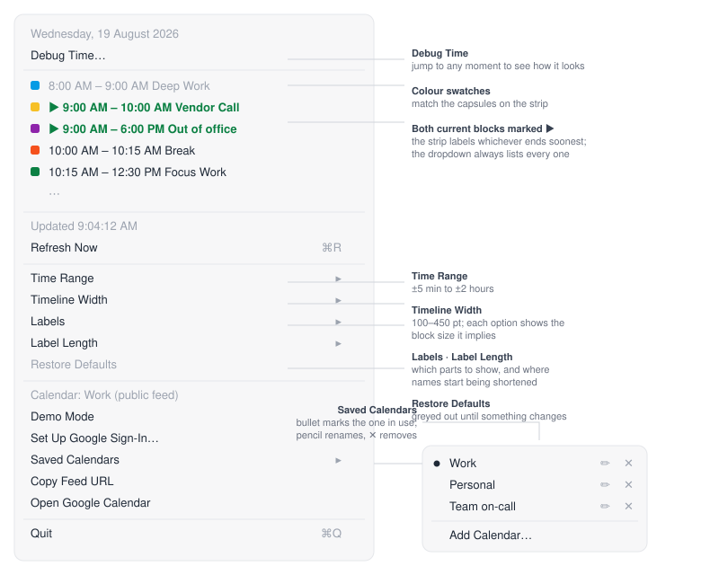
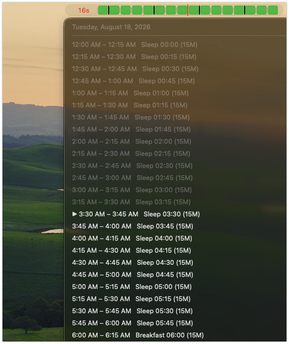

# macos-menubar-RollingCalendar

[](LICENSE)
[](#quick-start)
[](#known-limitations)

A macOS menu bar app that draws today's calendar as a horizontal timeline scrolling past a fixed "now" marker. Instead of asking *what time is my next thing*, you glance up and see where you are.

> **Status: in development.** Working and usable, but rough edges remain — see [Known limitations](#known-limitations). Behaviour, defaults and stored preferences may change without migration.

## The UI


Time flows right-to-left. The red line is fixed at the centre and always marks now, so blocks drift leftward as the day passes: what's left of the current block is to the left of the line, what's coming is to the right.

- **Black ticks** — hour boundaries, full height
- **Grey ticks** — 15-minute marks, shorter and lighter, three between each hour
- **Coloured blocks** — your events in their real Google Calendar colours, titled when wide enough, with a small gap between neighbours so back-to-back blocks stay legible
- **Countdown, far left** — time left in the block you're in (`1h05`, `12m`, `45s`), red in the final two minutes. Between blocks it reads `in 8m` until the next one
- **Window** — ±2 hours, about 360 px, plus a 54 px countdown gutter

Clicking the strip opens today's schedule:



### On a real Mac



The green boxes in the menu bar are the timeblocks; the red line through them is now, and `16s` at the left is the countdown. Each block here is 15 minutes, which is only ~22 px wide — too narrow for the title to fit, so they render as plain colour. Titles appear on wider blocks; the dropdown lists them in full, with the current one marked ▶︎ and past ones dimmed.

This is [Demo Mode](#testing-without-a-calendar) with the test grid, so every block is the same green and the schedule is synthetic — a real calendar gives each block its own colour. The strip is deliberately small: it lives in the menu bar and is meant to be read at a glance, not studied.

## Quick start

```bash
git clone <your-fork-url> rolling-calendar
cd rolling-calendar
chmod +x build.sh
./build.sh
open build/RollingCalendar.app
```

Needs macOS 13+ and Xcode Command Line Tools (`xcode-select --install`) for `swiftc`. No packages, no dependencies, no Xcode project — one shell script and seven Swift files.

**It starts in Demo Mode**, showing synthetic 15-minute blocks, so you can see it working before connecting anything. Click the strip → **Demo Mode** to turn that off once you've set up a real calendar.

To keep it: `cp -R build/RollingCalendar.app /Applications/`. To start it at login: **System Settings → General → Login Items → +**, then pick RollingCalendar.

> **No download link, on purpose.** Apple charges $99/year for the Developer ID needed to notarise an app, and macOS blocks downloaded apps that aren't notarised. Rather than hand you a binary you have to fight your own operating system to open, this project asks you to build it — which is also the only way to be certain the app matches the source you can read here.

### Uninstalling

```bash
pkill -f RollingCalendar.app
rm -rf /Applications/RollingCalendar.app
defaults delete io.github.macos-menubar-rollingcalendar   # forget settings
security delete-generic-password -s io.github.macos-menubar-rollingcalendar   # forget the Google token
```

Also revoke the app's access at [myaccount.google.com/permissions](https://myaccount.google.com/permissions) if you used Google sign-in.

## Connecting your calendar

Two modes. Nothing is baked into the app — it ships with no calendar configured.

| | Google sign-in | Public `.ics` feed |
|---|---|---|
| Event colours | **Yes**, real per-event colours | No — feeds carry none |
| Calendar stays private | Yes | No, must be shared publicly |
| Freshness | Live; ≤5 min | Google's cache lag, can be hours |
| Setup | One-time OAuth client | Paste a link |
| Recurring events | Expanded by Google | Expanded locally |

### Google sign-in (recommended)

Per-event colour exists only in the Google Calendar API — the `.ics` export has no colour field. Google also requires every app to be registered, so there's a one-time setup. You log in on Google's own page; the app never sees your password and asks only for `calendar.readonly`.

1. [console.cloud.google.com](https://console.cloud.google.com) → create or pick a project
2. **APIs & Services → Library** → enable **Google Calendar API**
3. **APIs & Services → OAuth consent screen** → User type **External** → add your own address under **Test users**
4. **Credentials → Create credentials → OAuth client ID** → Application type **Desktop app**
5. In the app: strip → **Set Up Google Sign-In…** → paste the Client ID and secret → **Save & Sign In**

Because the consent screen stays in Testing mode, Google shows an "unverified app" warning — **Advanced → Go to … (unsafe)**. Expected for a personal app; only your listed test users can sign in.

Then **Choose Calendar** lists every calendar on the account with its colour swatch. The one marked primary is your main calendar.

The refresh token is stored in your login Keychain. Colours resolve in this order: the event's own colour override → the calendar's colour → green.

### Public `.ics` feed

Strip → **Set Calendar Link…**, and paste any of these — the app works out the feed URL:

| You paste | App uses |
|---|---|
| `…/calendar/embed?src=you@gmail.com&ctz=…` | derived `.ics` feed |
| `…/calendar/u/0/newembed?src=you@gmail.com&ctz=…` | derived `.ics` feed |
| `…/calendar/ical/you%40gmail.com/public/basic.ics` | as-is |
| `…/private-abc123…/basic.ics` (secret address) | as-is |
| `webcal://…` | rewritten to `https://` |
| `you@gmail.com`, `…@group.calendar.google.com` | derived `.ics` feed |
| `file:///path/to/local.ics` | read from disk |

**HTTP 404 means the calendar isn't public.** Either share it publicly (Google Calendar → Settings and sharing → *Access permissions* → **Make available to public**), use the **Secret address in iCal format** under *Integrate calendar*, or sign in with Google instead.

A `ctz=` parameter in the link sets the time zone for ticks and event times; otherwise the Mac's own time zone is used.

## Testing without a calendar

**Demo Mode** (strip → *Demo Mode*) generates its own blocks: 96 per day at exactly 15 minutes, no overlaps, no gaps, coloured from Google's palette, titles carrying their start time. Useful for checking the drawing is correct independently of any data source.

The [`examples/`](examples/) folder has importable `.ics` files built on the same grid. They use floating local times, so they land on correct quarter-hours in any time zone. See [examples/README.md](examples/README.md).

## Configuration

Read from user defaults at launch — quit and relaunch to apply. Change `io.github.macos-menubar-rollingcalendar` if you edit `BUNDLE_ID` in `build.sh`.

```bash
# window: hours visible, centred on now (default 4 = ±2 h)
defaults write io.github.macos-menubar-rollingcalendar windowHours -float 2

# width: pixels per hour (default 90)
defaults write io.github.macos-menubar-rollingcalendar pixelsPerHour -float 70

# hide event titles inside blocks
defaults write io.github.macos-menubar-rollingcalendar showTitles -bool false

# translucent tinted blocks instead of solid fills
defaults write io.github.macos-menubar-rollingcalendar solidBlocks -bool false

# gap between blocks, points (default 3)
defaults write io.github.macos-menubar-rollingcalendar blockGap -float 5

# countdown gutter width (default 54; 0 hides the countdown)
defaults write io.github.macos-menubar-rollingcalendar countdownWidth -float 0

# text sizes; both default to the system menu bar size
defaults write io.github.macos-menubar-rollingcalendar titleFontSize -float 12
defaults write io.github.macos-menubar-rollingcalendar countdownFontSize -float 12
```

Only today is loaded; other days are ignored, though events straddling midnight still render at the window edges. The calendar is re-fetched every 5 minutes and on wake; the strip redraws every second.

## How it's built

| File | Purpose |
|---|---|
| `Sources/main.swift` | Config, `NSStatusItem`, menu, dialogs, fetch/redraw timers |
| `Sources/TimelineView.swift` | All drawing: ticks, now line, blocks, countdown |
| `Sources/GoogleAuth.swift` | OAuth 2.0, PKCE + loopback redirect, Keychain storage |
| `Sources/GoogleCalendarAPI.swift` | Calendar list, colour palette, events with `colorId` |
| `Sources/ICS.swift` | iCalendar parser, recurrence expansion (RRULE, EXDATE, overrides) |
| `Sources/CalendarSource.swift` | Normalizes any pasted calendar link into a feed URL |
| `Sources/DemoData.swift` | Synthetic 15-minute blocks for Demo Mode |
| `build.sh` | Compiles and packages the `.app` (LSUIElement, ad-hoc signed) |
| `examples/` | Importable 15-minute test calendars |
| `docs/` | UI diagrams and screenshots |
| `DISCLAIMER.md` | No-warranty and liability notice |

No storyboards, no `.xcodeproj`, no SwiftPM manifest. `swiftc` is invoked directly and the bundle is assembled by hand, so the whole build is readable in one file.

## Known limitations

- **Ad-hoc signed.** The signing identity changes on every rebuild, so macOS may re-prompt for Keychain access after each build.
- **The OAuth consent screen stays in Testing mode** unless you verify the app with Google, so only accounts you add as test users can sign in.
- **The local ICS parser handles a practical subset of RFC 5545.** `FREQ=DAILY/WEEKLY/MONTHLY/YEARLY` with `INTERVAL`, `BYDAY`, `BYMONTHDAY`, `UNTIL`, `COUNT`, plus `EXDATE` and `RECURRENCE-ID` overrides. `COUNT` truncation is approximate for `WEEKLY` with multiple `BYDAY` values. Google sign-in avoids all of this by expanding recurrence server-side.
- **All-day events** appear in the dropdown but not on the strip.
- **`.ics` feeds carry no colour**, so every block is green in feed mode.
- **Google's feed cache** means feed mode can lag well behind an edit. Sign-in mode is live.
- **The client secret is stored in user defaults**, not the Keychain. It isn't really secret for a desktop OAuth client, but it is plaintext on disk.
- **Single day only.** No multi-day view, no scrolling back.

## Privacy

Your calendar data never leaves your machine. The app talks only to Google (`googleapis.com`, `accounts.google.com`) or to the feed URL you provide, and nothing else — no analytics, no telemetry, no third-party services. Events are held in memory only and are never written to disk.

What is stored locally: your settings and the OAuth client ID/secret in `~/Library/Preferences/io.github.macos-menubar-rollingcalendar.plist`, and the Google refresh token in your login Keychain. The client secret is stored in plain text — it isn't truly secret for a desktop OAuth client, but be aware of it.

During sign-in the app briefly listens on `127.0.0.1` on a random port to catch Google's redirect, then shuts the listener down. Nothing is exposed beyond the loopback interface.

## Disclaimer

**This software is provided free of charge, "as is", without warranty or support of any kind, and is used entirely at your own risk.** It is a glanceable indicator, not a calendar, reminder or timekeeping system — it will never notify you of anything, and calendar data it shows may be stale, incomplete or absent. It must not be relied upon where inaccuracy, delay or failure could cause loss or harm. If you use a public iCalendar feed, you alone are responsible for what you make public. To the maximum extent permitted by law the author accepts no liability of any kind arising from its use, including missed appointments, disclosure of calendar data, or damage to any machine, system or data.

Not affiliated with, endorsed or supported by Google LLC.

Full terms: [DISCLAIMER.md](DISCLAIMER.md) and the [MIT Licence](LICENSE).

## Contributing

Issues and pull requests are welcome. Keep it dependency-free and keep the idle cost near zero.

## License

MIT © Mark Pelayo — see [LICENSE](LICENSE).
