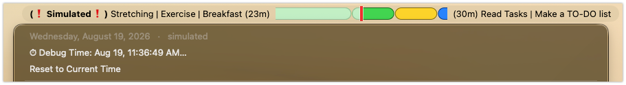
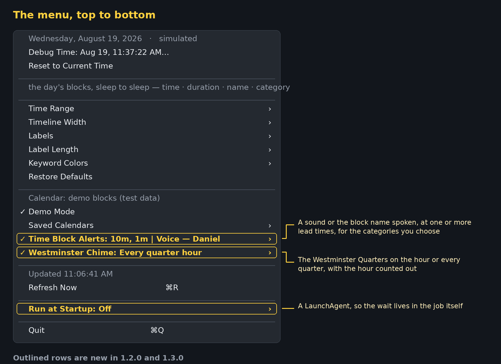
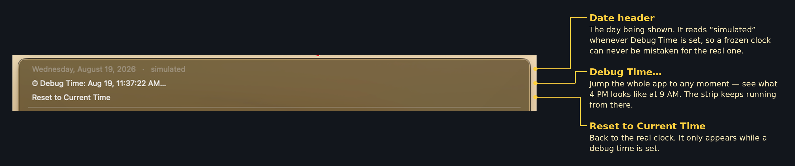
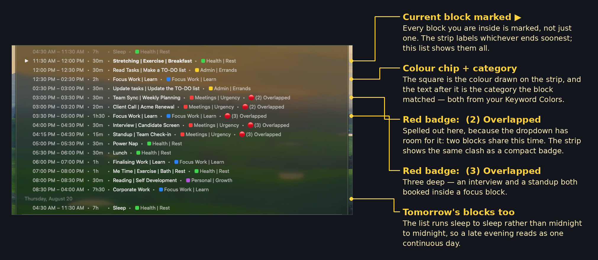
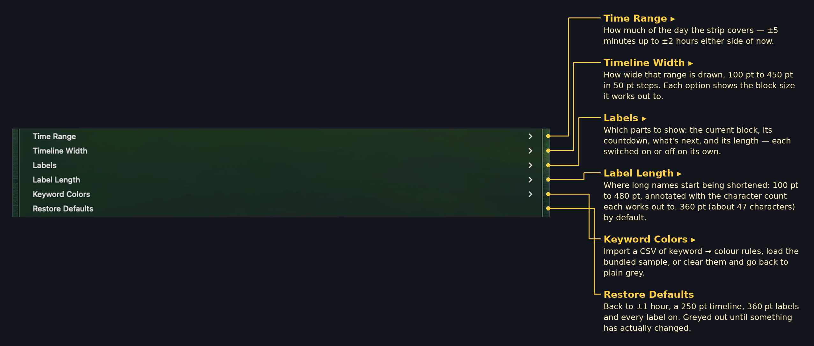
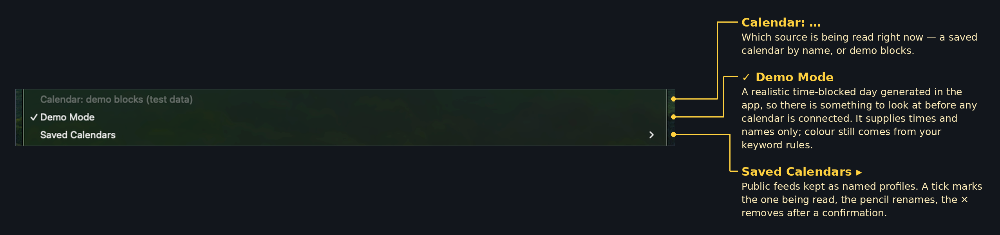
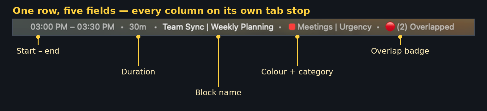

# macos-menubar-RollingCalendar

[](LICENSE)
[](#quick-start)
[](#known-limitations)
[](https://github.com/markpelayo/macos-menubar-RollingCalendar/releases/latest)

A macOS menu bar app that draws today's calendar as a horizontal timeline scrolling past a fixed "now" marker. Instead of asking *what time is my next thing*, you glance up and see where you are.

> **Status: in development.** Working and usable — [v1.3.0](CHANGELOG.md) is the current release — but rough edges remain, see [Known limitations](#known-limitations). Behaviour, defaults and stored preferences may change without migration.

## The UI



Time flows right-to-left. The red line is fixed at the centre and always marks now, so blocks drift leftward as the day passes. There are no tick marks or gridlines — just past, now and future.

- **Left label** — the block you're in and how much of it is left, e.g. `Deep Work (5m)`. It turns **red and bold** for the final two minutes, so the ending registers peripherally rather than needing to be read (`urgentSeconds` changes the threshold)
- **Right label** — what's next and how long that block runs for, e.g. `(16h) Out of office`
- **Labels size themselves to the name** — the menu bar item grows and shrinks as event names change, up to `maxLabelWidth` (360 pt by default, about 47 characters). Past that the *name* is shortened with an ellipsis; the countdown and the warning badge are never cut, since a truncated countdown would be useless. The capsules carry no text, as it would only repeat the labels
- **Coloured capsules** — your events in their real colours, outlined so neighbours stay distinct, separated by a 1 pt gap. Anything with no colour and no matching keyword is neutral grey, so unclassified events are obvious
- **Overlaps: shortest on top** — a 45-minute meeting inside a 1-hour block stays visible rather than hiding underneath it
- **Past is paler** — the same colour, lightened once it's behind the line, with a lighter outline to match. A block in progress fades from the left as it elapses, so you can see how far through it you are
- **Double-booking is flagged, not stacked** — the strip stays one row, and the badge's *side* tells you when the clash is. On the **right** it hasn't reached now yet: `(1h) Vendor Call 🔴(2)`. On the **left** it's live: `🔴(2) Vendor Call (59m)` — two things want you right this second. A clash appears on the right, crosses to the left as it reaches the now line, and clears when it's over. Open the dropdown, where each affected row spells it out as `🔴(2) Overlapped`
- **Window** — ±1 hour across 250 pt by default, plus however much the two labels need. Both are adjustable from the menu

The strip is deliberately small — it lives in the menu bar and is meant to be read at a glance, not studied.

Clicking it opens the day's blocks, and everything else lives in that menu:



The screenshots below are of the real menu, and cover it in four parts. They predate **Time Block Alerts**, **Westminster Chime** and **Run at Startup** — the map above is the current order.

### 1 · The header



### 2 · The day's blocks



### 3 · Appearance and colours



**Refresh Now (⌘R)** re-reads the feed immediately rather than waiting for the five-minute timer. It sits lower down now, beside the calendar it refreshes.

### 4 · Where the calendar comes from



## Quick start

```bash
git clone <your-fork-url> rolling-calendar
cd rolling-calendar
chmod +x build.sh
./build.sh
open build/RollingCalendar.app
```

Needs macOS 13+ and Xcode Command Line Tools (`xcode-select --install`) for `swiftc`. No packages, no dependencies, no Xcode project — one shell script and seven Swift files.

**It starts in Demo Mode**, showing a realistic time-blocked day, so you can see it working before connecting anything. Click the strip → **Demo Mode** to turn that off once you've set up a real calendar.

To keep it: `cp -R build/RollingCalendar.app /Applications/`. To start it at login: **System Settings → General → Login Items → +**, then pick RollingCalendar.

> **No download link, on purpose.** Apple charges $99/year for the Developer ID needed to notarise an app, and macOS blocks downloaded apps that aren't notarised. Rather than hand you a binary you have to fight your own operating system to open, this project asks you to build it — which is also the only way to be certain the app matches the source you can read here.

### Uninstalling

```bash
pkill -f RollingCalendar.app
rm -rf /Applications/RollingCalendar.app
defaults delete io.github.macos-menubar-rollingcalendar   # forget settings
```

## Connecting your calendar

Nothing is baked into the app — it ships with no calendar configured, and reads a **public iCalendar feed**. Colour comes from [keyword rules](#keyword-colors) rather than from the calendar, so a feed is all it needs.

Feed calendars are saved as **named profiles**, so you can keep several and switch with one click:

```
Calendar: Work (public feed)
Saved Calendars ▸
    ✓ Work            ✏️  ✕
      Personal        ✏️  ✕
      Team on-call    ✏️  ✕
      ─────────────────────
      Add Calendar…
```

A tick marks the calendar actually being read — nothing is ticked in Demo Mode, and **Saved Calendars** itself is ticked whenever a saved calendar is live. Click a row to switch to it. The **pencil** renames it, the **✕** removes it after a confirmation that spells out what happens — whether it's the one in use, or your last one. Only the saved link is ever forgotten; your actual calendar is untouched.

**Add Calendar…** asks for a name and a link. A link saved before profiles existed is adopted as a profile automatically, named after its address, so nothing is lost.

The link field accepts any of these — the app works out the feed URL:

| You paste | App uses |
|---|---|
| `…/calendar/embed?src=you@gmail.com&ctz=…` | derived `.ics` feed |
| `…/calendar/u/0/newembed?src=you@gmail.com&ctz=…` | derived `.ics` feed |
| `…/calendar/ical/you%40gmail.com/public/basic.ics` | as-is |
| `…/private-abc123…/basic.ics` (secret address) | as-is |
| `webcal://…` | rewritten to `https://` |
| `you@gmail.com`, `…@group.calendar.google.com` | derived `.ics` feed |
| `file:///path/to/local.ics` | read from disk |

**HTTP 404 means the calendar isn't public.** Either share it publicly (Google Calendar → Settings and sharing → *Access permissions* → **Make available to public**), use the **Secret address in iCal format** under *Integrate calendar*.

A `ctz=` parameter in the link sets the time zone used for event times; otherwise the Mac's own time zone is used.

## The dropdown list

Rows read `time • duration • name • category`, with the category's colour as an inline chip, plus `🔴(n) Overlapped` when a block shares time with others:

```
▶︎ 04:30 AM – 11:30 AM  •  7h     •  Sleep               •  ◼︎ Health | Rest
   11:30 AM – 12:00 PM  •  30m    •  Stretching          •  ◼︎ Health | Rest
   12:30 PM – 02:30 PM  •  2h     •  Focus Work | Learn  •  ◼︎ Focus Work | Learn
   03:00 PM – 03:30 PM  •  30m    •  Team Sync           •  ◼︎ Meetings | Urgency  •  🔴(2) Overlapped
   03:00 PM – 03:20 PM  •  20m    •  Client Call         •  ◼︎ Meetings | Urgency  •  🔴(2) Overlapped
   ─── Thursday, August 20 ───
   04:30 AM – 11:30 AM  •  7h     •  Sleep               •  ◼︎ Health | Rest
```



Every column lines up exactly, which takes three things: hours are zero-padded; times and durations use **tabular figures**, since SF's default digits are proportional and `1` is narrower than the rest; and each field sits on a **tab stop** measured from the widest time and duration in the list.

Tab stops rather than padding with spaces, because padding by character count doesn't align proportional text — `7h` and `30m` are 2 and 3 characters, and `m` is 4 pt wider than `h`, so the separator after them drifts by up to 4 pt however many spaces you add. Tab stops position by point.

**The list runs anchor to anchor, not midnight to midnight.** It starts at the block that opened your current day and ends at the next one, so a night shift reads as a single stretch instead of being severed at midnight — and you see the whole shape of the day rather than a pile of past events and two future ones.

The anchor defaults to any block whose title contains **`sleep`**. Consecutive anchor blocks merge into one run, so a sleep split into 15-minute chunks still counts as a single boundary.

If a day has no anchor — or the day's anchor hasn't happened yet — it falls back to **today plus a rolling 24 hours** rather than the calendar day, so there's always a future to see. A day-only fallback would hide everything past midnight even while the strip was already showing it.

```bash
# anchor the day on something else
defaults write io.github.macos-menubar-rollingcalendar dayAnchorKeyword "wake"
```

A date separator marks where one day becomes the next, since otherwise today's 4:30 AM and tomorrow's look identical. Long cycles are capped at 60 rows with an "… and N more" line.

## Keyword colors

Colour blocks by what they're *called*, rather than by which calendar they came from.

**The fastest start is Keyword Colors ▸ Use Sample Colors** — 37 keywords across six categories, applied instantly. **Save Sample CSV…** writes that same set out as a file you can edit in a spreadsheet and bring back with **Import CSV…**, so you're never starting from a blank sheet.

The format is three columns:

```csv
category,color (color name or hex),keyword
Focus Work | Learn,#286DCD,focus
Health | Rest,green,meal
Personal | Growth,purple,meal prep
Travel | Buffers,#7A7A7A,commute
```

| Column | Used for |
|---|---|
| `category` | Grouping in the menu — not matched against |
| `color` | The colour drawn. **A hex or a name** — `#28CD41`, `28CD41` and `green` all work |
| `keyword` | Matched against the event's title |

One colour column, not two — a separate name and hex only invites them to disagree.

Names map to macOS's own system colours — blue is blue, black is black, nothing reinterpreted:

`red` `orange` `yellow` `green` `mint` `teal` `cyan` `blue` `indigo` `purple` `pink` `brown` `gray` `light gray` `dark gray` `black` `white`

Blocks are drawn at full opacity, so a hex renders as exactly that hex.

The importer is deliberately forgiving, because spreadsheets aren't:

- **Any delimiter** — comma, semicolon or tab. Excel picks one based on your locale, so it isn't assumed
- **Any column order**, and header wording it can't match is fine — `color (color name or hex)` works
- **No header row at all** — the colour column is found by looking for values that *are* colours, and the keyword column by which one varies most
- **Legacy files** with separate `color_name` and `color_hex` columns still import, taking the hex
- Blank spacer rows, quoted fields, CRLF endings, and Latin-1 files from Excel

Anything that's neither a hex nor a known name is skipped and named in the summary. If an import fails outright, the error shows what the parser actually saw — delimiter, which column it took for what, and the first data row — so the fix is visible rather than guesswork. There's a working example in [`examples/keyword-colors.csv`](examples/keyword-colors.csv).

### How a keyword is matched

**Longer phrases win.** Rules are sorted by word count before matching, so a two-word keyword is always tested before a single word. Given both `meal` (green) and `meal prep` (purple):

| Event title | Colour | Matched |
|---|---|---|
| `Meal prep for the week` | 🟣 purple | `meal prep` |
| `meal-prep` | 🟣 purple | `meal prep` |
| `Meal_Prep` | 🟣 purple | `meal prep` |
| `Lunch` | 🟢 green | `lunch` |
| `Prep the meal` | 🟢 green | `meal` |
| `Oatmeal breakfast` | — | nothing: `meal` isn't a whole word here |

**Separators don't matter.** Both the title and the keyword have every non-alphanumeric character flattened to a space, so `meal prep`, `meal-prep` and `meal_prep` are one keyword, and a title like `Focus Work | Learn (2H)` matches `focus` cleanly.

**Whole words only.** `meal` matches "Prep the meal" but not "Oatmeal", which stops short keywords colouring things by accident.

Matching is case-insensitive. Repeated keywords are kept once. Clearing the rules puts everything back.

### Uncategorized blocks

Anything with no match keeps whatever colour it already had — its Google colour, or **neutral grey `#8E8E93`** if it has none. Grey therefore means "no rule covers this yet", which is a useful prompt to add a keyword rather than a colour choice.

The **Keyword Colors** submenu lists it below your categories with its swatch, so grey on the strip is recognisable rather than a mystery:

```
23 keywords from calendar colors.csv
──────────────────────────────────
🟦  Travel | Buffers  ·  3
🟨  Admin | Errands  ·  3
🟪  Personal | Growth  ·  2
🟩  Health | Rest  ·  6
🟥  Meetings | Urgency  ·  5
🟦  Focus Work | Learn  ·  4
──────────────────────────────────
⬜  Uncategorized  ·  no keyword match
──────────────────────────────────
Import Another CSV…
Clear Keyword Colors
```

Keep grey reserved for this: if a category also uses grey, "unclassified" stops being readable at a glance. `unmatchedColor` in defaults changes it if you'd rather grey were free for a category.

## Debug Time

Under the date at the top of the dropdown, **Debug Time…** moves the app to any moment — pick a date and time and the strip renders as if it were then. Useful for checking how a crowded afternoon, an overlap, or the end of the day looks without waiting for it.

The simulated clock **keeps running** from the point you pick, so blocks still slide and countdowns still tick; it isn't frozen. Events are re-fetched for the simulated date, so you can jump to another day entirely.

While it's active the left label gains a marker: `(❗Simulated❗) 🔴(2) Out of office (22m)`. Only the marker is bold — the rest of the label keeps its normal weight, so it reads as an annotation rather than changing the label itself. The date line also says `· simulated` and the menu shows the pretend time.

**Nothing is tinted, washed or dimmed.** The point of jumping to another time is to see the real colours at that time, so the strip is drawn exactly as it would be for real. **Reset to Current Time** puts it back, and the picker has a **Use Current Time** button.

The offset survives a relaunch, which is what you want mid-testing. If the strip ever looks wrong, check for the purple tint first.

## Testing without a calendar

**Demo Mode** (strip → *Demo Mode*) generates a plausible day in-app: sleep, focus blocks, meals, a nap, an evening shift that runs past midnight, and two deliberate collisions — a double-booked call at 15:00, and a stretch at 16:15 where an interview and a standup both land inside a focus block, so the 🔴 badges have something to report.

It supplies only what a calendar would — **times and names, never colours**. Colour comes from the same [keyword rules](#keyword-colors) as a real feed, so **Clear Keyword Colors** turns the demo grey exactly as it would turn your calendar grey. On a first launch the sample rules are applied once, so it looks configured out of the box.

Because it starts and ends on sleep, it also exercises the dropdown's [sleep-to-sleep cycle](#the-dropdown-list).

The [`examples/`](examples/) folder has importable `.ics` files built on the same grid. They use floating local times, so they land on correct quarter-hours in any time zone. See [examples/README.md](examples/README.md).

## Time Block Alerts

A heads-up shortly before a block starts — a system sound, the name spoken aloud, or both. Off until you set it up, and the menu is deliberately staged: **when**, then **how**, then **which blocks**. Each step stays greyed out until the one above it is answered, and the parent item is ticked only once an alert could actually happen.

```
✓ Time Block Alerts: 10m, 1m | Voice — Daniel ▸
                        Alert Me Before: 10 minutes, 1 minute ▸
                                                       Off
                                                       1 minute before      ✓
                                                       5 minutes before
                                                       10 minutes before    ✓
                                                       Add Custom…
                        ─────────────────────────────
                        Alert Sound: Off ▸             Off · 14 system sounds · your own · Custom Sound…
                        Voice Sound: British · male — Daniel ▸
                                                       Off
                                                       British · male — Daniel
                                                       American · female — Samantha
                                                       Robot — Zarvox
                                                       Premium Voices ▸   American
                                                                            Ava — installed
                                                                            Zoe — download, ≈430 MB
                                                                          British
                                                                            Jamie — installed
                                                                            Serena — download, ≈180 MB
                                                                          Australian
                                                                            Karen — download, ≈185 MB
                                                                            Lee — download, ≈165 MB
                                                                            Matilda — download, ≈115 MB
                                                                          Manage Voices…
                        ─────────────────────────────
                        Categories: all ▸              All Categories, then one row per category
                        ─────────────────────────────
                        Test Alert Now
```

**Lead times are a set, not a choice.** Every row in *Alert Me Before* is a toggle, so ten minutes to start wrapping up and one minute to actually move can both be armed; **Add Custom…** adds another rather than replacing what's there, and custom values sit alongside the presets where you can click them off again. They all share the one sound or voice — only the number spoken changes. **Off** clears the lot.

**Those rows, and the category rows, don't dismiss the menu.** AppKit closes a menu the moment an ordinary item is clicked, which is right for a choice and wrong for a set — arming three lead times would otherwise mean three trips through the menu. They're custom views that handle the click themselves: the tick changes under the pointer, sibling rows re-read their own state, and the parent rows above rewrite their titles in place.

Each block is announced once *per lead time*, and an alert that's more than 30 seconds late — the app was launched mid-window, or the Mac was asleep — is marked done rather than announced, since saying "10 minutes before" with three minutes left is simply wrong. When two lead times land in the same second, the nearer number is the one spoken.

**The parent item carries the whole configuration** — `Time Block Alerts: 10m, 1m | Voice — Daniel`, with `| 3 categories` appended when it isn't every category — so the setup is readable from the main menu without opening anything. Each row inside does the same for its own setting, and **Off** lives inside each submenu rather than as a separate checkbox: one control per decision.

**Sound and speech are exclusive.** Choosing a sound switches the voice off, choosing a voice switches the sound off. One alert, one way of announcing itself — a chime under a sentence makes both harder to make out, and having to remember which of two checkboxes is on is worse than seeing one answer on the parent item.

**The sounds are the ones macOS already ships** in `/System/Library/Sounds` — fourteen, quietest first, which is all Apple provides. Choosing one plays it. **Custom Sound…** copies an AIFF, WAV, MP3 or M4A into `~/Library/Sounds`, where `NSSound` can find it by name from then on; it appears in its own group below the system ones, and anything already in that folder is picked up automatically. A file macOS can't actually open is refused rather than copied in and left silent.

**Speech** is `AVSpeechSynthesizer` — no network, no permission prompt. It says *"5 minutes before Focus Work"*, taking the lead time from your own setting so the two can't disagree, and reading only the part of the name before the first `|`, since a bar reads aloud as an awkward pause. Two blocks starting together are announced in one sentence rather than talking over each other.

Three voices are always offered, because every Mac has them: **Daniel** (British), **Samantha** (American) and **Zarvox** (robot, the nearest thing macOS ships to a synthetic assistant). Each row shows the voice that will actually speak, and reads *not installed* rather than being selectable if the Mac hasn't got it.

Those three are *compact* voices, which is why they sound clipped. **Apple's Premium voices are the fix** — the same `AVSpeechSynthesizer`, neural rather than concatenative, and genuinely natural. They're a free download rather than something an app can bundle, so **Premium Voices ▸** lists the catalogue for the three accents worth having whether or not you've got them:

| Accent | Voices |
|---|---|
| American | Ava, Zoe |
| British | Jamie, Serena |
| Australian | Karen, Lee, Matilda |

A voice you have reads **— installed** and is selectable, which speaks a sample. One you don't reads **— download, ≈180 MB** and opens *Manage Voices* when clicked, because a voice nobody knows exists is a voice nobody downloads. It appears as installed next time the menu opens. Anything Enhanced or Premium that's installed but *not* in that list — a downloaded Enhanced Samantha, another locale — is listed separately, so nothing on your Mac is hidden by my choice of catalogue.

Indian, Irish and South African English Premium voices exist too, and are reachable through *Manage Voices*; they're left out of the menu only to keep it short. Sizes are what System Settings reports and drift between macOS releases, so they're shown as approximate.

**Siri is not offered, and can't be.** Those voices are reserved for Siri and for Spoken Content: `AVSpeechSynthesisVoice.speechVoices()` doesn't return them to an app, there's no API to name one, and making one the **System Voice** doesn't help either — asking the synthesiser to speak without naming a voice gets a default substituted rather than the Siri voice the system is set to. Tested with *System voice: Siri (Voice 2)*, the app still spoke in a compact voice. An entry that quietly says the right words in the wrong voice is worse than no entry, so every voice listed here is one you'll actually hear.

Nothing called Jarvis exists as a macOS voice either; *Robot — Zarvox* is the nearest thing shipped. If you want natural speech, **Ava (Premium)** is the recommendation: download it once, pick it by name, and there's no ambiguity about what comes out.

**Categories** narrow it further — announce meetings but not focus blocks, say. *All Categories* is stored as an empty selection rather than a list of every name, so a category added to your CSV later is included rather than quietly left out. Blocks that matched no rule are covered by the **Uncategorized** row.

The check runs on the same one-second tick as the redraw, and each block is remembered by start time, name **and lead time** until the app quits. Changing the lead times or the categories forgets that, so a block skipped a moment ago can still be announced under the new settings. All-day events never trigger an alert.

A Notification Center **banner** is also posted, if macOS has granted permission. It's a bonus rather than the mechanism: this app is built locally rather than notarised, so that permission may never be granted — the sound and the speech don't depend on it.

## Westminster Chime

The tune people mean by "Big Ben", on your own Mac's clock. It's separate from Time Block Alerts on purpose: it marks the hour, not your calendar, and doesn't care what's in it.

```
✓ Westminster Chime: Every quarter hour ▸
                        Off
                        On the hour
                      ✓ Every quarter hour
                        ─────────────────
                      ✓ Strike the Hour Count
                        Volume: 50% ▸        25% · 50% · 75% · 100%
                        ─────────────────
                        Hear It ▸            Quarter past · Half past · Quarter to · The hour
                        Stop Ringing
```

**What the real clock does.** Four quarter bells play five four-note *changes* — rearrangements of the same four notes, G♯, F♯, E and B — and the Great Bell, the one actually named Big Ben, strikes the hour afterwards:

| Time | Changes played |
|---|---|
| Quarter past | 1 |
| Half past | 2, 3 |
| Quarter to | 4, 5, 1 |
| On the hour | 2, 3, 4, 5 — then the hour struck |

The hour is counted on a twelve-hour clock, so one o'clock is one blow and midday is twelve. That's exactly what this does, including the count.

**It's synthesised, not sampled.** A recording of Big Ben is someone's copyright; the tune, written in 1793, is not. So the bells are built out of sine partials — a bell is a fundamental plus a stack of inharmonic overtones, the hum below it and the tierce a minor third above, each fading at its own rate. Nothing is bundled with the app and nothing is downloaded. It won't be mistaken for the Elizabeth Tower, but it is unmistakably the tune.

Timing is a little brisker than the real clock — notes 1.2 s apart, strikes 4 s — so midday takes about 70 seconds rather than two minutes. **Strike the Hour Count** off leaves just the tune, which is a good deal less imposing at midnight. The audio is rendered on a background thread when the quarter comes round, played through `AVAudioEngine`, and released when the last note dies away; the hardware is let go with it.

A quarter rings once, and only within five seconds of its moment — waking a sleeping Mac at twenty past shouldn't set the bells off for the quarter it slept through.

## Run at Startup

**Off until you ask for it** — putting something into your login sequence is your call, so nothing is written to `~/Library/LaunchAgents` until you switch it on. A wait is worth choosing: at login the Mac is starting everything at once, and the strip isn't what you need in the first few seconds of that. It sits in its own block below Refresh Now, ticked whenever it will launch at login — with or without a wait. The item shows the current setting, so *Run at Startup: After 20 s* tells you where you stand without opening the submenu:

```
Run at Startup: After 20 s ▸    Off
                                On
                                Delay for:
                                  5 s
                                  10 s
                                  15 s
                                  20 s
                                  30 s
                                  60 s
```

It's a **LaunchAgent**, not a Login Item, which is what makes the wait possible — the delay lives in the job itself. launchd runs a short-lived `/bin/sh` that sleeps and then *replaces itself* with the app, so once the wait is over nothing extra is left running:

```xml
<key>ProgramArguments</key>
<array>
  <string>/bin/sh</string>
  <string>-c</string>
  <string>sleep 20; exec '/Applications/RollingCalendar.app/Contents/MacOS/RollingCalendar'</string>
</array>
<key>RunAtLoad</key><true/>
<key>ProcessType</key><string>Interactive</string>
```

`ProcessType` is `Interactive` rather than `Background` deliberately: a background job sits in a low-priority band macOS is free to defer, which quietly turns "no delay" into "some unpredictable delay".

The agent lives at `~/Library/LaunchAgents/io.github.macos-menubar-rollingcalendar.plist` and points at the app **where it was when you switched it on** — so if the app isn't in `/Applications`, you're told once, since moving that folder afterwards would break it. The app re-checks at every launch and repairs the path if it has moved. Removing it is the menu's *Off*, or:

```bash
launchctl bootout gui/$UID/io.github.macos-menubar-rollingcalendar
rm ~/Library/LaunchAgents/io.github.macos-menubar-rollingcalendar.plist
```

## Configuration

Most of it is in the menu — click the strip:

| Menu | What it does |
|---|---|
| **Time Range ▸** | How much time is visible: ±5 min through ±2 hours (default ±1 hour) |
| **Timeline Width ▸** | How much menu bar the timeline takes: 100 pt to 450 pt in 50 pt steps (default 250 pt) |
| **Labels ▸** | Four toggles: block name and time left on the left, block name and duration on the right (all on by default) |
| **Label Length ▸** | How long an event name may get before it's shortened: 100 pt to 480 pt, each annotated with the character count it works out to (default 360 pt, about 47 characters) |
| **Restore Defaults** | Back to ±1 hour, 250 pt timeline, 360 pt labels, all labels on. Greyed out when nothing has been changed |
| **Westminster Chime ▸** | The hour, or every quarter, on synthesised bells — with the hour counted out (**off** by default) |
| **Time Block Alerts ▸** | A sound or the block name spoken, at one or more lead times before a block starts, for the categories you choose (**off** by default) |
| **Refresh Now (⌘R)** | Re-reads the feed immediately instead of waiting for the five-minute timer |
| **Run at Startup ▸** | Off, on, or on after a wait of 5–60 s (**off** by default) |

The two are independent: **range** decides how much time you see, **width** decides how much space it gets. Together they set how big a block looks — at the default ±1 hour across 250 pt, a 15-minute block is about 31 pt wide; narrow the range to ±15 minutes at the same width and it grows to 125 pt. Each width option's tooltip does that arithmetic for you, and the note at the foot of the menu shows the current result.

The rest is user defaults, read at launch. Change `io.github.macos-menubar-rollingcalendar` if you edit `BUNDLE_ID` in `build.sh`.

```bash
# thickness of the red now line, points (default 4)
defaults write io.github.macos-menubar-rollingcalendar nowLineWidth -float 6

# how long before a block ends the left label goes red and bold, seconds (default 120)
defaults write io.github.macos-menubar-rollingcalendar urgentSeconds -float 300

# colour for events matching no keyword and carrying none of their own (default #8E8E93)
defaults write io.github.macos-menubar-rollingcalendar unmatchedColor "#C7C7CC"

# translucent tinted blocks instead of solid fills
defaults write io.github.macos-menubar-rollingcalendar solidBlocks -bool false

# gap between blocks, points (default 1)
defaults write io.github.macos-menubar-rollingcalendar blockGap -float 3

# square the capsules off a bit (default 0 = capsule, radius is half the height)
defaults write io.github.macos-menubar-rollingcalendar blockCornerRadius -float 3

# text size; defaults to the system menu bar size
defaults write io.github.macos-menubar-rollingcalendar titleFontSize -float 12
```

Total menu bar width is `timelineWidth` plus whatever the two labels currently need, so it changes through the day as event names change. `maxLabelWidth` is the ceiling on each side.

### Which block gets the label when two overlap

**Time decides first.** The left label names whatever ends soonest — that's the deadline that matters — and the right names whatever starts soonest. So a one-hour meeting inside an all-day block takes the label while it runs, and the all-day block takes it back afterwards.

Only when two candidates tie *exactly* does chain position break it, preferring the block that belongs to a back-to-back run: its start meets another's end and its end meets another's start. That's your time-blocked backbone, and a meeting dropped on top of it chains to nothing, so the backbone keeps the label while 🔴 tells you something extra is sitting on it.

If they're still tied — identical start *and* end, like two trainings both booked 1–2 — geometry can't separate them, and it falls back to shorter-first then alphabetical, purely so the choice is stable rather than flickering. Telling "my own time block" from "a meeting someone sent me" reliably needs the organiser/attendee fields from the Google API, which isn't wired up yet.

Only today is loaded; other days are ignored, though events straddling midnight still render at the window edges. The calendar is re-fetched every 5 minutes and on wake; the strip redraws every second.

## How it's built

| File | Purpose |
|---|---|
| `Sources/main.swift` | Config, `NSStatusItem`, menu, dialogs, fetch/redraw timers |
| `Sources/TimelineView.swift` | All drawing: capsules, now line, gutter labels, overlap badges |
| `Sources/ICS.swift` | iCalendar parser, recurrence expansion (RRULE, EXDATE, overrides) |
| `Sources/CalendarSource.swift` | Normalizes any pasted calendar link into a feed URL |
| `Sources/CalendarRowView.swift` | Saved-calendar menu row with inline rename and remove buttons |
| `Sources/KeywordRules.swift` | CSV import, keyword matching and longest-phrase precedence |
| `Sources/DemoData.swift` | Synthetic 15-minute blocks for Demo Mode |
| `build.sh` | Compiles and packages the `.app` (LSUIElement, ad-hoc signed) |
| `examples/` | Importable 15-minute test calendars |
| `docs/` | UI diagrams and screenshots |
| `DISCLAIMER.md` | No-warranty and liability notice |

No storyboards, no `.xcodeproj`, no SwiftPM manifest. `swiftc` is invoked directly and the bundle is assembled by hand, so the whole build is readable in one file.

## Known limitations

- **The local ICS parser handles a practical subset of RFC 5545.** `FREQ=DAILY/WEEKLY/MONTHLY/YEARLY` with `INTERVAL`, `BYDAY`, `BYMONTHDAY`, `UNTIL`, `COUNT`, plus `EXDATE` and `RECURRENCE-ID` overrides. `COUNT` truncation is approximate for `WEEKLY` with multiple `BYDAY` values.
- **All-day events** appear in the dropdown but not on the strip.
- **Feeds carry no colour of their own**, so blocks are coloured by keyword rules or shown as uncategorized grey.
- **Google's feed cache** means an edit can take a while to reach the app — minutes to hours, and not under the app's control.
- **Single day only.** No multi-day view, no scrolling back.

## Privacy

Your calendar data never leaves your machine. The app fetches the feed URL you provide and nothing else — no accounts, no sign-in, no analytics, no telemetry, no third-party services. Events are held in memory only and are never written to disk.

What is stored locally: your settings, saved calendar links and imported keyword rules, all in `~/Library/Preferences/io.github.macos-menubar-rollingcalendar.plist`. No credentials, because there are none to store.

## Disclaimer

**This software is provided free of charge, "as is", without warranty or support of any kind, and is used entirely at your own risk.** It is a glanceable indicator, not a calendar, reminder or timekeeping system — it will never notify you of anything, and calendar data it shows may be stale, incomplete or absent. It must not be relied upon where inaccuracy, delay or failure could cause loss or harm. If you use a public iCalendar feed, you alone are responsible for what you make public. To the maximum extent permitted by law the author accepts no liability of any kind arising from its use, including missed appointments, disclosure of calendar data, or damage to any machine, system or data.

Not affiliated with, endorsed or supported by Google LLC.

Full terms: [DISCLAIMER.md](DISCLAIMER.md) and the [MIT Licence](LICENSE).

## Contributing

Issues and pull requests are welcome. Keep it dependency-free and keep the idle cost near zero.

## Releases

Versions are tagged and described in [CHANGELOG.md](CHANGELOG.md), which is the only copy of the
notes — `./release-notes.sh 1.3.0` prints one version's section for a release body. The same notes appear on the
[releases page](https://github.com/markpelayo/macos-menubar-RollingCalendar/releases). Each release
carries source only — no app bundle, for the notarisation reason above — so installing a given
version means checking out its tag and running `./build.sh`:

```bash
git checkout v1.3.0
./build.sh
```

## License

MIT © Mark Pelayo — see [LICENSE](LICENSE).
